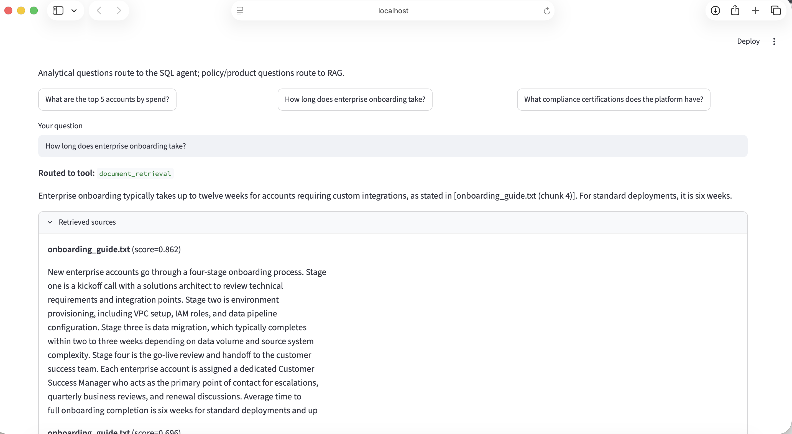
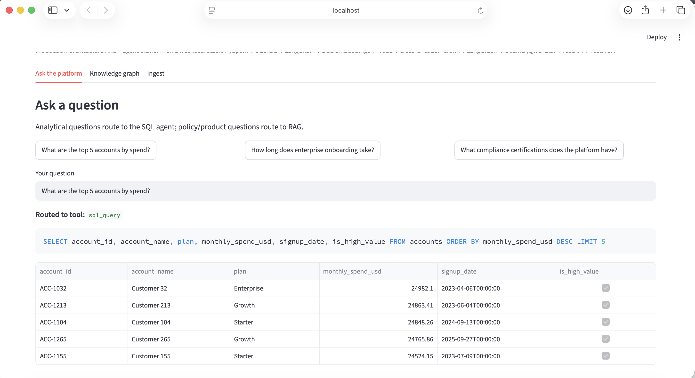
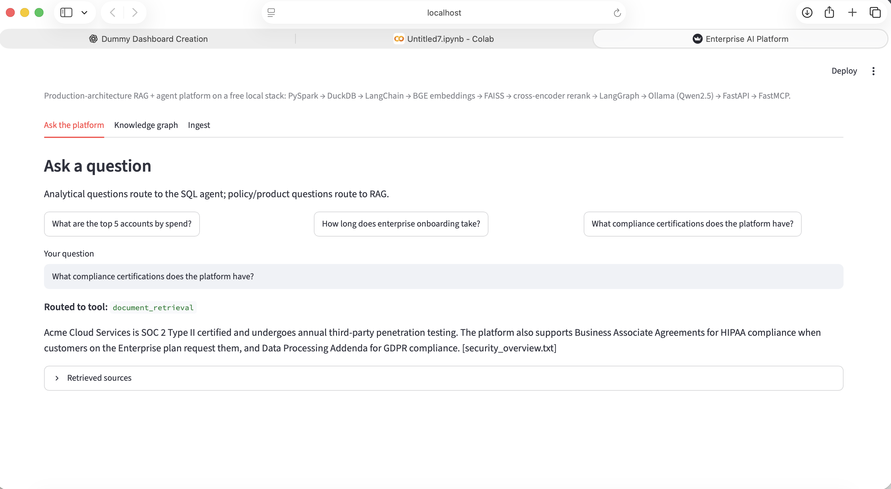
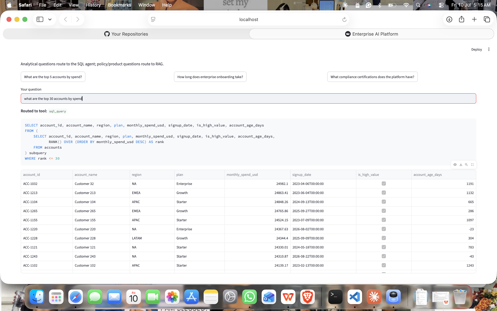
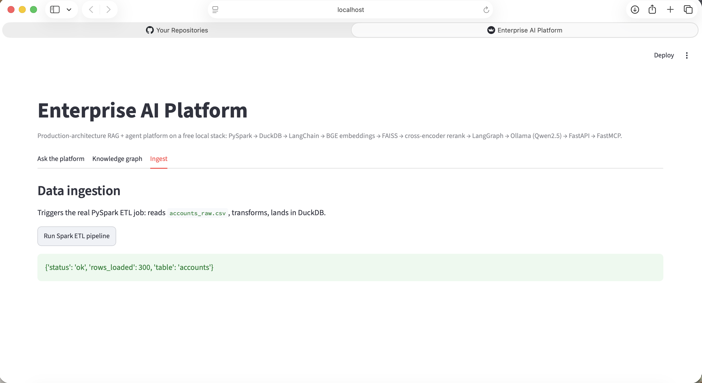
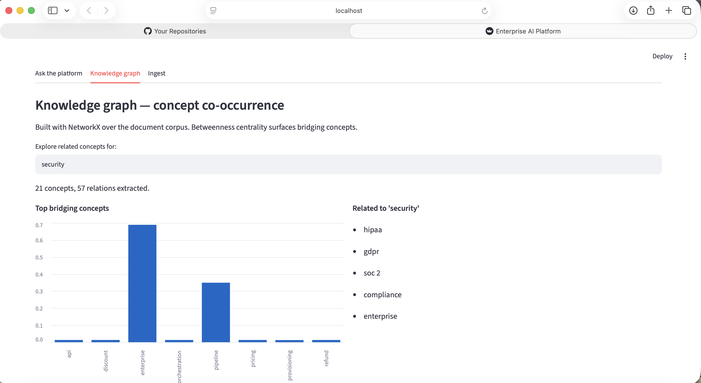

# Enterprise AI Platform

A production-architecture RAG + AI agent platform, running entirely on a
free, local, open-source stack. Every component is a real, industry-used
technology — nothing here is a placeholder or a simulation of a real tool.






## Architecture

```
 accounts_raw.csv
        │
        ▼
 ┌───────────────┐
 │  Spark ETL      │   real PySpark, local mode
 │  (app/etl)      │
 └───────┬───────┘
         ▼
 ┌───────────────┐
 │   DuckDB          │   analytical warehouse (BigQuery-compatible SQL)
 │  (app/warehouse)  │
 └───────────────┘

 sample_docs/*.txt
        │
        ▼
 LangChain Loader → RecursiveCharacterTextSplitter → BGE Embeddings
        │
        ▼
 ┌───────────────┐
 │     FAISS          │   vector index
 └───────┬───────┘
         ▼
 Cross-Encoder Reranker (BGE-reranker)
         │
         ▼
 ┌─────────────────────────────┐
 │      LangGraph Workflow            │
 │                                     │
 │   planner ──► sql_agent ──────┐    │
 │      │                         ├──►│──► answer
 │      └──────► document_agent ─┘    │
 └─────────────────────────────┘
         │
         ▼
   Ollama (Qwen2.5:7B) — grounded generation
         │
         ▼
   FastAPI (app/api) ──► FastMCP tool server (app/mcp_server.py)
         │
         ▼
   Streamlit frontend (streamlit_app.py)

 sample_docs/*.txt ──► NetworkX knowledge graph (app/graph) ──► related concepts
```






## Production → free-stack mapping

Every technology below is genuinely running, not stubbed out — the table
maps each one to its production counterpart.

| Layer | Production | This project (free, local) |
|---|---|---|
| Distributed ETL | Spark (cluster) | **Real PySpark**, local mode — same DataFrame API, only `master()` changes for a cluster |
| Analytical warehouse | BigQuery | **DuckDB** — same SQL dialect family, in-process columnar engine |
| Vector database | AlloyDB Vector Search | **FAISS** — the same ANN library underlying much of production vector search |
| Embeddings | Gemini embeddings | **BGE** (`BAAI/bge-small-en-v1.5`) via sentence-transformers — near the top of the MTEB leaderboard among local-friendly models |
| Reranking | (often skipped or a hosted reranker) | **BGE cross-encoder reranker** — genuine two-stage retrieve-then-rerank |
| Document/chunk handling | LangChain (cloud loaders) | **LangChain** — same library, local file loader instead of a cloud connector |
| LLM | Gemini | **Ollama + Qwen2.5:7B** — fully local inference, no API key |
| Agent framework | Google ADK | **LangGraph** — typed-state multi-agent graphs, the standard open-source analogue |
| Tool protocol | MCP | **FastMCP** — real MCP server, real tool discovery/invocation |
| Graph analytics | Neo4j / Spanner Graph | **NetworkX** — in-memory graph + centrality analysis |
| API layer | FastAPI (cloud-deployed) | **FastAPI** — identical, just running on localhost |
| Frontend | Streamlit / internal tool | **Streamlit** — identical |

Every module's docstring in the code repeats its specific swap and the
exact line(s) you'd change to point at the managed service instead.


## Project layout

```
app/
  api/            chat.py, ingest.py, sql.py  — FastAPI routers
  rag/            loader.py, splitter.py, embeddings.py, vectorstore.py,
                  retriever.py, reranker.py, pipeline.py
  llm/            ollama.py
  agents/         planner.py, sql_agent.py, document_agent.py, workflow_agent.py
  warehouse/      duckdb.py
  graph/          knowledge_graph.py
  etl/            spark_pipeline.py
  config.py
  main.py         FastAPI entry point
  mcp_server.py   FastMCP server
data/
  accounts_raw.csv     synthetic input for the Spark ETL job
  sample_docs/*.txt    synthetic policy docs for RAG
demo.py           one-shot CLI walkthrough of every stage, no servers needed
streamlit_app.py  frontend (calls the FastAPI backend over HTTP)
check_setup.py    diagnoses which components are running at full strength
requirements.txt
.env.example
```

## Running it

### 1. Install

```bash
python3 -m venv venv && source venv/bin/activate   # optional but recommended
pip install -r requirements.txt
cp .env.example .env
```

You'll also need a JRE for PySpark (`java -version` — if missing:
`apt install openjdk-21-jre-headless` on Linux, `brew install openjdk` on Mac).

### 2. (Recommended, one-time) Install Ollama for real LLM generation

The app runs without this step — it automatically falls back to
extractive (retrieval-only, non-generative) answers if Ollama isn't
running. But the resume bullet is about grounded *generation*, so it's
worth the five minutes:

```bash
# Install Ollama from https://ollama.com, then:
ollama pull qwen2.5:7b
```

Leave the Ollama app running in the background. Everything else
auto-detects it — no config changes needed.

### 3. Check what's active

```bash
python check_setup.py
```

This tells you exactly which components are running at full strength
(BGE embeddings, Ollama generation) vs. on their offline fallback
(TF-IDF, extractive answers), and what to install to close the gap.

### 4. Run the one-shot demo

```bash
python demo.py
```

Walks through Spark ETL → LangGraph agent routing → RAG → graph
analytics → MCP tool calls, all in one process, printed to your terminal.

### 5. Run the full app

```bash
# Terminal 1
uvicorn app.main:app --reload --port 8000

# Terminal 2
streamlit run streamlit_app.py
```

Open the Streamlit URL it prints. API docs are at `http://localhost:8000/docs`.

### 6. (Optional) Run the MCP server standalone

```bash
python -m app.mcp_server
```

Exposes `sql_query`, `document_search`, and `related_knowledge_concepts`
as MCP tools over stdio — connectable from any MCP client (e.g. Claude
Desktop's MCP config).

## What's real vs. what has a fallback

Everything in the mapping table above is real, installed, working code —
verified end-to-end while building this (real PySpark job, real FAISS
index, real MCP tool round-trip, real HTTP calls between Streamlit and
FastAPI). Two components have a first-run dependency on external
downloads that your environment may or may not have when you first run
it:

- **BGE embeddings/reranker** download their weights from Hugging Face
  the first time `sentence-transformers` loads them (~130MB + ~280MB).
  If that download fails, the app logs a clear warning and falls back to
  local TF-IDF so nothing breaks — but the intended, better path is the
  real BGE models.
- **Ollama generation** requires the Ollama app running locally with
  `qwen2.5:7b` pulled. Without it, the app falls back to extractive
  (quote-and-cite, non-generative) answers.

Both fallbacks exist purely so the app never hard-crashes if you run it
somewhere offline — the honest, intended state is both dependencies
installed, which `check_setup.py` will confirm.


